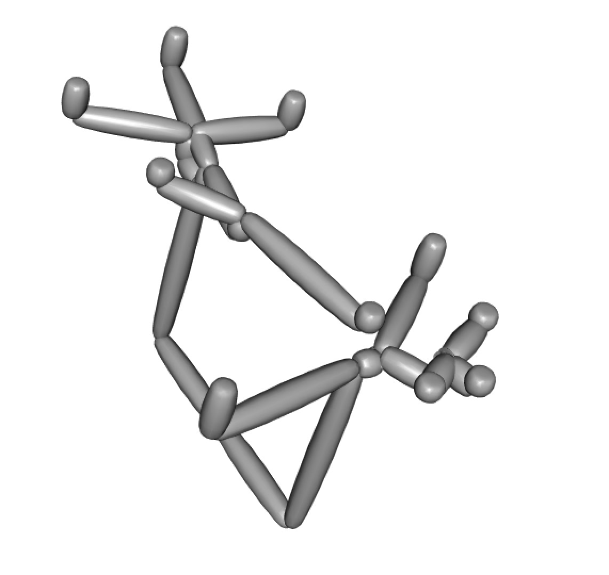

# 3Dtree
Way to make a 3D tree in R



Inspired by


To use:

```
install.packages("devtools")
devtools::install_github("bomeara/Tree3D")
library("Tree3D")
phy <- ape::rcoal(20)
Plot3DTree(phy)
```
